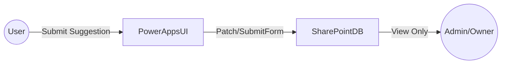

# PowerApps_Anonymous_SuggestionBox

간단한 **익명 제안함**을 구축하기 위한 Power Apps + SharePoint 프로젝트입니다.  
팀원 누구나 익명으로 의견을 제출할 수 있고, 지정된 담당자만 조회할 수 있도록 설계되었습니다.

 

## 특징 (Features)
- **익명성 보장**: 제안자가 누군지 식별되지 않도록 데이터 구조 및 권한을 설정
- **Power Apps UI**: 최소한의 텍스트 입력과 제출 버튼으로 구성된 간단한 화면
- **SharePoint 저장**: 제안 내용이 SharePoint 리스트에 적재되며, 일반 사용자는 조회 불가
- **모바일 지원**: Microsoft Teams와 연계되어 휴대폰에서도 쉽게 접근 가능
- **확장성**: 향후 알림 기능, 데이터 분석(통계), 추가 권한 관리 등을 붙일 수 있음

 

## 구성 (Stack & Architecture)
- **Power Apps**: 사용자 인터페이스(UI), 익명 제안 입력 폼
- **SharePoint Online**: 데이터 저장소 (리스트)
  - 권한 설정을 통해 입력만 가능, 조회는 제한
- (선택) **Microsoft Teams**: 사용자가 접근하기 편리한 채널

### 메모
- **민감한 정보(회사·연구소 이름, 구체적 인프라 주소 등)는 명시하지 않았습니다.**  
- **이미지·캡처**는 불필요하다면 제외하거나, 로고가 담긴 이미지를 업로드하지 않도록 주의하세요.  
- **구체적인 환경(테넌트 정보, AD 계정 등)은 절대 공개 저장소에 포함하지 말아야 합니다.**

이렇게 **프로젝트 이름**과 **README.md**를 준비하시면, GitHub에 올릴 최소한의 문서를 갖추게 됩니다. 이후 소스(파워앱스 스크린 캡처, JSON 설정 등)를 원하는 수준만큼 업로드하면 됩니다.  
